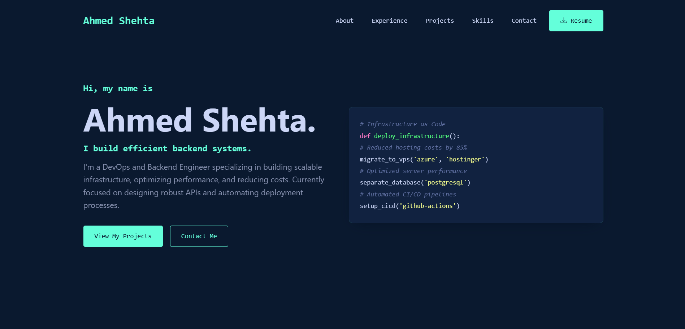
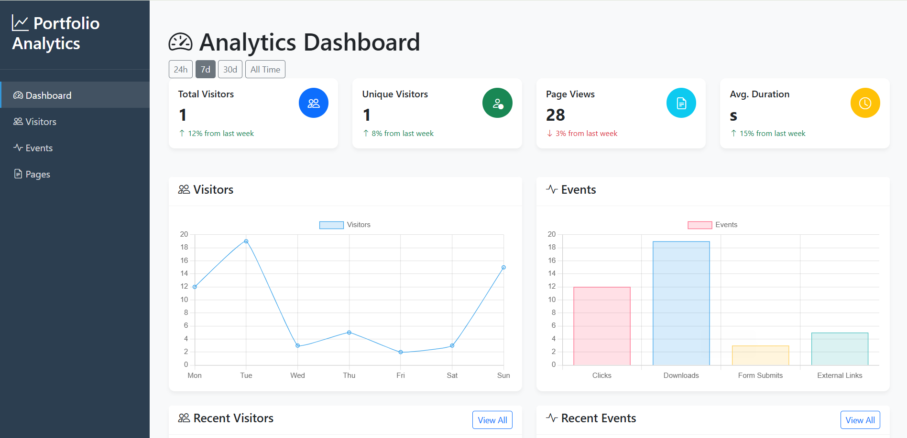

# 📈 Portfolio Analytic – Web Analytics Dashboard

**Portfolio Analytic** is a Django-based web analytics dashboard that tracks and visualizes visitor interactions across your website. It records session data, page views, click events, user devices, locations, and more — giving you actionable insight into how users behave on your site.

---

## 🧠 What It Does

This app helps you:

- Track **visitors** by session, IP, device, and country
- Monitor **page views**, including referrer and time spent
- Record detailed **events** like clicks, hovers, and interactions
- Analyze user behavior over time using **charts and dashboards**
- Get metadata like browser, OS, and device type for each user
- Store and query interaction data using Django ORM

---

## 🖼️ Example Use Case

Imagine you're running a portfolio website or landing page. With Portfolio Analytic:

- See which pages are most visited and for how long
- Know which countries your traffic comes from
- Understand how users interact with buttons or elements
- View session-based behavior in real time or over time

---

## 🔍 Data Model Overview

### 🧑‍💻 `Visitor`

Tracks individual users using session keys, IPs, and metadata.

```python
ip_address, session_key, country, device_type, browser, os, timestamp
```

### 📄 `PageView`

Logs each page visited with timestamp, duration, and referrer.

```python
visitor, url, timestamp, duration
```

### 🖱️ `Event`

Captures user interactions (e.g. clicks) with optional metadata.

```python
event_type, element_id, element_text, page_url, metadata
```

---

## 🛠️ Tech Stack

- **Backend**: Django
- **Database**: SQLite (dev), PostgreSQL (prod)
- **Frontend**: Bootstrap (or custom HTML/CSS templates)
- **Analytics**: Custom JS tracking snippet (optional)
- **Charts**: Chart.js, Plotly, or Django templates with context data

---

## 📸 Screenshots




---

## 🚀 Getting Started

```bash
# Clone the repository
git clone https://github.com/developer-ahmed-shehta/portfolio_analytic.git
cd portfolio_analytic

# Create a virtual environment
python -m venv venv
source venv/bin/activate  # On Windows: venv\Scripts\activate

# Install dependencies
pip install -r requirements.txt

# Apply migrations
python manage.py migrate

# Run the server
python manage.py runserver
```
